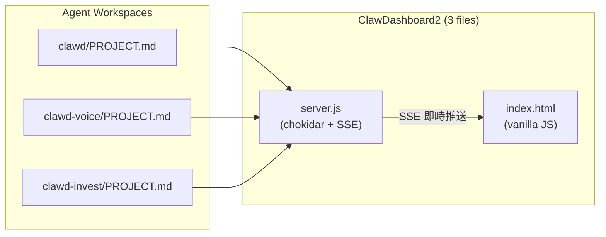

# ClawDashboard2 — 系統架構

## 技術選型：極簡

整個 Dashboard 只有 **3 個檔案**。不用 React、不用 Vite、不用 build step。

```
ClawDashboard2/
├── server.js      ← ~150 行，Node.js (chokidar + SSE + 靜態檔案)
├── index.html     ← 單檔 UI，vanilla JS + CSS，瀏覽器直接跑
└── package.json   ← 唯一依賴：chokidar
```

### 為什麼不用 React + Vite

| | v1 (React + Vite + Express) | v2 (vanilla HTML + Node) |
|:---|:---|:---|
| npm 依賴 | ~200 packages | **1 package** (chokidar) |
| 安裝時間 | 30-60 秒 | **< 2 秒** |
| build step | 需要 `npm run build` | **不需要** |
| 檔案數 | 數百個 | **3 個** |
| 記憶體 | ~100MB+ | **~30MB** |
| 啟動 | `npm run dev` (Vite + Express) | `node server.js` |

Dashboard 本質是「讀 `.md` 顯示」— 不需要 virtual DOM、不需要 state management、不需要路由。
一個 HTML 檔 + `EventSource` 接 SSE 就能即時更新。

---

## 設計原則

1. **File-first** — 所有狀態存在 `.md` 檔中，不靠 API、不用 DB
2. **零耦合** — Agent 不需要知道 Dashboard 存在，只維護自己的 `PROJECT.md`
3. **自動發現** — 有 `PROJECT.md` 的目錄 = Agent，不需要註冊
4. **Agent 自治** — 每個 Agent 自己管理任務生命週期（含清理歸檔）
5. **極簡** — 3 個檔案、1 個依賴、1 行啟動

---

## 資料流



## Dashboard 不需要 DB

v1 用 SQLite 存 tasks、status、agent_states。
v2 **不需要 DB** — 所有資料直接從 `.md` 檔解析，存在記憶體中：

| v1 (SQLite) | v2 (記憶體 + `.md`) |
|:---|:---|
| `status` table | `PROJECT.md` 的 `## Status` |
| `tasks` table | `PROJECT.md` 的 `## Tasks` checklist |
| `agent_states` table | 各 agent 的 `PROJECT.md` Status |
| `logs` table | `PROJECT.md` 的 `## Log` |

---

## server.js 架構 (~150 行)

```javascript
// 偽代碼 — 實際開發時的骨架

const http = require('http');
const fs   = require('fs');
const path = require('path');
const chokidar = require('chokidar');

const WORKSPACE = process.env.WORKSPACE_ROOT || '.';
const PORT = process.env.PORT || 3001;

// ---- 1. File Watcher ----
const agents = new Map();  // agentName → parsed data

const watcher = chokidar.watch(`${WORKSPACE}/**/PROJECT.md`, {
  depth: 2,
  ignored: ['**/node_modules/**', '**/.git/**'],
  awaitWriteFinish: { stabilityThreshold: 500 }
});

watcher.on('add',    f => updateAgent(f));
watcher.on('change', f => updateAgent(f));
watcher.on('unlink', f => removeAgent(f));

function updateAgent(filePath) {
  const parsed = parseProjectMd(filePath);
  agents.set(parsed.name, parsed);
  broadcast('update', parsed);
}

// ---- 2. Markdown Parser ----
function parseProjectMd(filePath) {
  const content = fs.readFileSync(filePath, 'utf8');
  // 用 ## heading 分割 sections，解析 Status/Tasks/Log
  return { name, status, tasks, log, mtime, directory };
}

// ---- 3. SSE ----
const clients = new Set();

function broadcast(event, data) {
  for (const res of clients) {
    res.write(`event: ${event}\ndata: ${JSON.stringify(data)}\n\n`);
  }
}

// ---- 4. HTTP Server ----
const server = http.createServer((req, res) => {
  if (req.url === '/api/events') {
    // SSE endpoint
  } else if (req.url === '/api/agents') {
    // JSON: all agents
  } else {
    // Serve index.html
  }
});

server.listen(PORT);
```

## index.html 架構

```html
<!-- 單檔，不需要 build -->
<!DOCTYPE html>
<html>
<head>
  <style>
    /* 所有 CSS 都在這裡 */
  </style>
</head>
<body>
  <aside id="sidebar"><!-- Agent 列表 --></aside>
  <main id="detail"><!-- 選中 Agent 的詳情 --></main>

  <script>
    // SSE 連線
    const es = new EventSource('/api/events');
    es.addEventListener('update', e => {
      const agent = JSON.parse(e.data);
      renderAgent(agent);
    });

    // 全部 vanilla JS，不需要 React
  </script>
</body>
</html>
```

---

## Agent 自動發現

```
WORKSPACE_ROOT/
├── clawd/
│   └── PROJECT.md        ← 自動偵測 "clawd"
├── clawd-voice/
│   └── PROJECT.md        ← 自動偵測 "clawd-voice"
├── clawd-invest/
│   └── PROJECT.md        ← 自動偵測 "clawd-invest"
├── some-folder/
│   └── (沒有 PROJECT.md)  ← 忽略
└── ClawDashboard2/        ← Dashboard 本身，忽略
```

**規則：含 `PROJECT.md` 的一級子目錄 = 一個 Agent。**

---

## 啟動與部署

```bash
# 安裝（< 2 秒）
npm install

# 開發啟動
WORKSPACE_ROOT=/home/david/project node server.js

# PM2 背景常駐
pm2 start server.js --name claw2 -- --workspace /home/david/project
```

只需一個 process，不像 v1 要分別啟動 backend + frontend。
